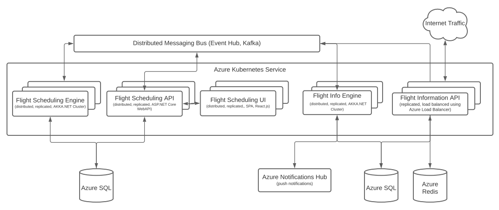
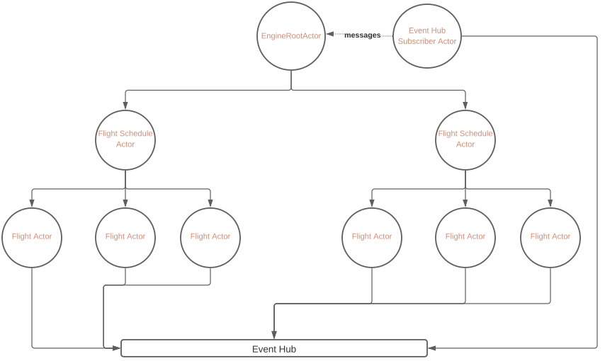
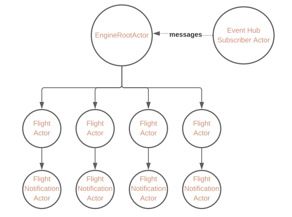

## System Overview
For any given airline operating at an airport, the system provides a browser based UI for airline staff to manage regularly scheduled flights. The system presents a "Shared Calendar View" of all the flights departing on a given day, week, month etc and allows airline staff to manage their outbound flights. 

The core business logic for the system utlises `RRule` strings to generate the recurring flights. Using `RRule` means that airline staff can set the schedule regularly repeating flights as a 'series' as opposed to manually creating flights per day, per week, per month etc. Any amendment to the flight schedule means that the entire series of upcoming flights can be automatically adjusted.

A shared calendar allows airline staff to compare their flights with other airlines to ensure no conflicts occur. The airport can also set a global `max_flights` property, which can function as an upper ceiling for number of flights permitted daily.

---
## General Assumptions 
- Product is multi-tenant, each airline has read-access to the departure schedule
- Airlines are able to pick a departure gate when setting the flight status to boarding
- System allows selection from only available departure gates
- A "regularly scheduled" flight has the same recurrent time across different days of the week
- Each flight has only a single departure per day (i.e. the granularity of recurrence is bound to daily)
- System can automatically set the status of a flight to check-in 48 hours prior to departure
- Recurrence schedule of a flight with `status=check_in` cannot be altered
- Departure gates are always available
- No "auditing" features available in this version of the product
- All SQL relational modelling is depicted using [EF Core Conventions](https://docs.microsoft.com/en-us/ef/core/modeling/relationships?tabs=fluent-api%2Cfluent-api-simple-key%2Csimple-key#conventions)

---

## Techology Stack
- ASP.NET Core
- Entity Framework Core
- AKKA.NET
- React.js
- Docker
- Azure Kubernetes Service
- Azure SQL
- Azure Notification Hub
- Azure Event Hub (Kafka)
- Azure Redis

---

## Core Domain Objects
`Airline` - Models a given airline 

### Basic model:
```csharp
public class Airline {
    public int Id { get; set; }
    public string Name {get; set; } 
}
```

### Basic model:
`FlightSchedule` - Models a regularly scheduled flight

```csharp
    public class FlightSchedule {
        public int Id { get; set; }
        public int FlightNumber {get; set; }
        public string RecurrenceRule {get; set; }

        public Airline Airline { get; set; }
        public Destination Destination { get; set; }
    }
```

`Flight` - Models a departing flight

```csharp
    public class Flight {
        public int Id { get; set; }
        public int FlightNumber { get; set; }
        public FlightStatus FlightStatus {get; set; }
        public Destination Destination { get; set; }

        public DateTime ScheduledDepartureTimeUtc { get; set; }
        public DateTime EstimatedDepartureTimeUtc { get; set; }
        public DateTime ActualDepartureTimeUtc { get; set; }

        public DepatureGate DepartureGate { get; set; }
        public FlightSchedule FlightSchedule {get; set; }
        public Airline Airline { get; set; }
    }
```

`User` - Models user of the system 

```csharp
    public class User {
        public int Id { get; set; }
        public string SubjectId { get; set; }
        public string FirstName { get; set; } 
        public string LastName  { get; set; } 

        public List<UserPermissions> UserPermissions { get; set; }
    }
```

`UserPermissions` - Models a crew member of a given airline

```csharp
    public class UserPermissions {
        public int Id { get; set; }
        public int User { get; set; }

        public Airline AirlineId { get; set; }
        public string Role { get; set; }
    }
```

`DepartureGate` - Models a departure gate
```csharp
    public class DepartureGate {
        public int Id { get; set; }
        public string Name { get; set; }
    }
```

`Passenger` - Models a flight passenger

```csharp
    public class Passenger {
        public int Id { get; set; }
        public string Name { get; set; }
        public string Email { get; set; }
        public string CellPhoneNumber { get; set; }  
    }
```

`PassengerFlightNotificationSubscription` - Models a subscription to get notifications for a given flight for a passenger

```csharp
    public class PassengerSubscription {
        public int Id { get; set; }
        public string GcmDeviceId { get; set; } //google cloud manager
        public string ApnsDeviceId { get; set; } //apple push notification service

        public FlightInformation FlightInformation { get; set; }
        public Passenger Passenger { get; set; }  
    }
```

`FlightInformation` - Models passenger facing information for a given flight

```csharp
    public class FlightInformation {
        public int Id { get; set; }
        public string FlightNumber { get; set; }
        public string Airline { get; set; }

        public DateTime ScheduledDepartureTimeLocal { get; set; }
        public DateTime EstimatedDepartureTimeLocal { get; set; }
        
        public string Destination { get; set; }
        public string DepartureGate { get; set; }
    }
```

`FlightStatus` - Models status of a given flight
```csharp
    public enum FlightStatus {
        OnTime = 0,
        CheckIn = 1,
        Boarding = 2,
        Departed = 3,
        Cancelled = 4,
        Delayed = 5
    }
```

## Primary Components



### Flight Scheduling UI
This is the primary UI for the airline staff for managing scheduled flights. It presents a calendar type view of the all the past, current and upcoming flights for all airlines in a single unified view.

``` 
Note: As per specs, the user is only allowed to change data for their Airline. The access given to this logged
in user can be derived from querying the UserPermissions table.
```

For an upcoming scheduled flight for which the status is `OnTime`, a user can:
- Create a new scheduled flight
- Edit a scheduled flight
- Remove a scheduled flight

Once a flight's has transitioned into the `CheckIn` status, a user can:
- Change status of a flight to `Boarding, Departed, Cancelled or Delayed`

Once a flight's status is set to `Boarding`:
 - User is prevented to selecting any other statuses
 - User is able to allocate a departure gate

```
The UI is a brower based single page application and can use Bearer Token authentication by utilising a authentication server which supports OIDC and OAuth 2 protocols e.g. IdentityServer, Azure B2C, Azure AD, Auth0, Okta etc.
```

### Flight Scheduling API
Built using ASP.NET Core's api controllers, this web api application exposes the flight scheduling functionality to end users.

One point to highlight here is that for `command` type operations, i.e. operations that mutate the state of a flight schedule or a flight, are not handled in an API controller. Instead, a `message` is published to Event Hubs for asynchronous processing. Given that the messages are consistently published to the same partitions (using partition keys), ordering can be guranteed. Given that two users at the same time might be editing the same flight schedule, a race condition can be resolved using the last save wins type heuristic. This might not be desirable, but its an assumption being made here.

All controllers can be stateless and hence if required, multiple replicas of this application can be run in kubernetes and use a load balancer to distribute load equally among all replicas.

### Flight Scheduling Engine
The flight scheduling engine is the business logic layer of the application. It is a distributed parallel data processing application built using Akka.Net and [utilises the actor programming model](https://en.wikipedia.org/wiki/Actor_model). 



Core actors are:

`EventHubSubscriberActor`
Actor responsible for maintaining a subscription with Event Hub and routing the messages to the `FlightSchedulerRootActor`.

In case of transient errors such as network errors, the connection can be re-established.

`FlightSchedulerRootActor`

When a request for creation of a new flight schedule is received, this actor creates an instance of the `FlightSchedulerActor` and provides it with the details of the flight schedule. This actor is lean, simple and mostly used for message distribution.


| Operation              | Destination Actor        |
|------------------------|--------------------------|           
| `CreateNewSchedule`    | FlightSchedulerRootActor |
| `EditFlightSchedule`   | FlightScheduleActor      |
| `DeleteFlightSchedule` | FlightScheduleActor      |
| `CreateFlight`         | FlightScheduleActor      |
| `EditFlight`           | FlightActor              |


`FlightScheduleActor`

This actor is resposible for management of the flight schedule in the database as well creation of `Flight` actor when a flight's departure time is 48 hours or less.

It handles messages for:
- Initialising a new flight schedule (i.e. creating `FlightSchedule` database entry)
- Editing the FlightSchedule for which this actor exists
- Scheduling a message send to self at correct time intervals, based on RRule for creation of `FlightActor`
- Removal of flight schedule

```csharp
//Since the RRule defines the recurrence pattern of upcoming flight, the creation of next flight can be calcuated using:

//1. Calculate the time span from now
var timeSpan = NextDateTimeFromRRule.Subtract(DateTime.UtcNow);

//2. In the actor, set the next time to take up and create the flight, message contains all the details.
system
   .Scheduler
   .ScheduleTell(TimeSpan.FromSeconds(0),
             timeSpan,
             self, message, self);

```

`FlightActor`

This actor is created for a flight which is ready for `CheckIn`. Any status changes or other operations related to the specific instance of this flight are handled by this actor. For example, if the airline staff edit the status from `CheckIn` to `Delayed`, this actor is responsible for updating the database and posting an event to Event Hubs about the operation. 

#### Messages published to event hub:
| Message                        | Data                     |
|--------------------------------|--------------------------|           
| `FlightCreated`                | flightId, airline, flightNumber, flightStatus, destination, scheduledDepartureTimeUtc, estimatedDepartureTimeUtc, actualDepartureTimeUtc, departureGate |
| `FlightStatusChanged`          | flightId, flightStatus   |
| `FlightDepartureGateAssigned`  | flightId, depatureGate   |


```
This actor can also self-monitor. For example, it can raise an alert if a departure gate hasn't been allocated by the airline staff 3 hours before departure.

```

Testing of business logic can be easily performed by writing test cases against the flight actor and ensuring it maintains data integrity and generates the required events. 


```
At given time, the engine will have active actors for all flights with the status set to `CheckIn`, effectively modelling state of departures across the airport.
```

### Flight Info Engine

The flight info engine is also a distributed parallel data processing application built using Akka.Net. 



The core actors are:

`EventHubSubscriberActor`
Actor responsible for maintaining a subscription with Event Hub and routing the messages to the `EngineRootActor`.

In case of transient errors such as network errors, the connection can be re-established.


`EngineRootActor`
The primary root actor responsible for: 

- Creating `FlightActor` as when `FlightCreated` message is received
- Routing messages to the correct `FlightActor` based on `flightId` property of the message data


`FlightActor`

This actor is created for a flight and is responsible for processing all messages corresponding to a given `flightId`.

#### Messages handled:
| Message                        | Operation                                                                                                        |
|--------------------------------|------------------------------------------------------------------------------------------------------------------|           
| `FlightCreated`                | Creates a new `FlightInformation` object and persists it to the database                                         |
| `FlightStatusChanged`          | Reads, modifies and persists the `FlightInformation` object. Notifies `FlightNotificationActor` of the event.    |
| `FlightDepartureGateAssigned`  | Reads, modifies and persists the `FlightInformation` object. Notifies `FlightNotificationActor` of the event.    |
| `AddSubscriber`                | If a passenger with the same email does not exist, creates a new `Passenger` object. Also creates the `PassengerFlightNotificationSubscription` object, persists them both to to the database                                                             | 
| `RemoveSubscriber`             | Removes the `PassengerFlightNotificationSubscription` object from the database                                   |


`FlightNotificationActor`

This actor is responsible for sending push notifications via Azure Notification Hub. Based on the device registered, the notification will either be sent via Google Cloud Manager or Apple Push Notifiction Service.

All subscribed passengers for the flight are fetched by querying `PassengerFlightNotificationSubscription` table and notified either the `FlightStatusChanged` or `FlightDepatureGateAssigned` message is received. 


### Flight Info API
Built using ASP.NET Core's api controllers, this web api application exposes the flight information functionality to end users and flight information display boards.

Since push notifications inherently require a native mobile application for either iOS or Android, it can be assumed that a passenger queries for flight information using an app. It is also assumed that the passenger requires no further authentication or authorization to subscribe to updates for a flight, **the device itself is registered with the backend**. Optionally, when the passenger clicks the `subcribe to flight` (or similar) button, some information such as email, mobile number etc can be collected to prevent junk subscriptions.

Flight Information screens can also query the API to get a list of departing flights. Assuming that some sort of polling mechansim is used to query the API at set intervals and refresh the screens.

To deal with traffic spikes - replication, caching and load balancing can be utilised.

---

## Notes on system architecture
The system utilises an event driven architecture and loosely coupled components to achieve the desired outcomes. Keeping each component independent results in better scalibility in terms of development as well as deployment. 

The system also relies on reliable messaging to ensure message delivery, hence if the Flight Scheduling Engine becomes unavailable, the messages for it will not be lost. When it finally comes back online, it can catch up with all the pending messages. 

Akka.Net is used to cater for the __real time__ aspects of the system, for example multiple airlines might be modifying flights and schedules at the same time. Since each flight schedule and flight is modelled as an actor, multiple messages can be processed in parallel without any concern of conflicts. Akka.Net clustering can be utilised to scale the system as necessary. Functionality for imposing business logic such as "alert when flight status not updated in the last 60 minutes" or "alert if flight departure gate not assigned 120 minutes prior to departure" can be easily implemented and tested. 

---

### CI/CD

Each component of the system can be containerized using Docker and deployed to Azure Kubernetes Service. A CI/CD service such as Azure DevOps can be used to automatically build and deploy code to various environments.

The following deployment stages can be implemented:

`Local -->  Dev --> UAT --> Pre-Prod --> Prod`

---

### Testing
System is optimised to ensure that each component can be indepently tested.

- Each actor can be unit tested in isolation to ensure correct behavior. 
- UI unit tests for react app can be done using Jest
- Automated End to end tests can be done using Selenium, Appium etc.

---

### Local development experience

- A single VS solution can be created with each backend component modelled as a project
- UI Projects can be developed using VS Code in case of the flight scheduler UI or native apps as per specs
- Common domain objects can be housed in a dll and referenced across the solution
- Each backend component can be run locally using Visual Studio's container orchestration features
- Project configuration for local environment can be maintained using a combinatino of appsetting, secrets and envrionment variables
- Whole solution can be run locally from Visual Studio by creating a simple `docker-compose.yml` file

---

## Cloud vs on prem
- Deployment on prem can be done via a techology such as Azure Stack
- Internet facing services can be exposed as necessary

